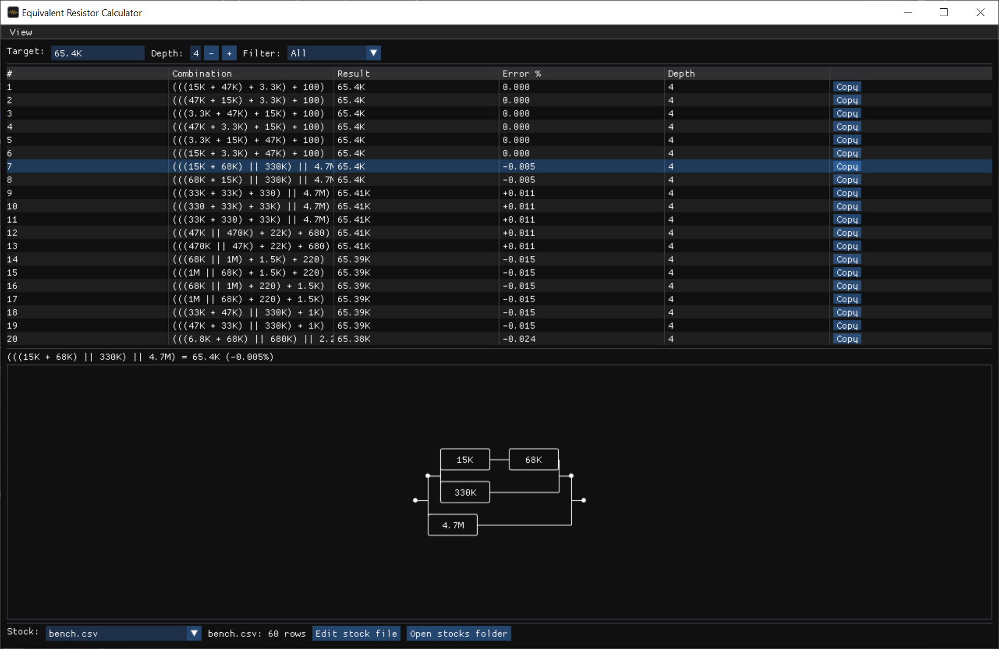

# Equivalent Resistor Calculator

A Windows desktop tool that finds series/parallel combinations of on-hand resistors approximating a target resistance value, searching a user-maintained stock of parts kept as CSV files.



## Features

- Enter any target resistance (`65.4K`, `2M`, `1meg`, `100R`, or plain ohms) and search combinations of the parts in your stock, up to a configurable depth (number of resistors used).
- Results are ranked by error and shown with the resulting value, error %, and depth; one click copies a combination expression to the clipboard.
- Schematic view of the selected combination (series / parallel network).
- Filter the search by package type (through-hole / SMD).
- Stock is a set of plain CSV files you can edit by hand or from the built-in editor; the folder is watched, so external edits are picked up live.

## Stock files

Stocks live in `%APPDATA%\EquivalentResistorCalculator\stocks\*.csv`. On first run a default `default.csv` is seeded. The CSV format is:

```csv
Value,Label,Package
15000,15K,ThroughHole
3300,,SMD
```

- `Value`: resistance in ohms (plain decimal number).
- `Label`: display label; when empty it is auto-formatted from the value.
- `Package`: `ThroughHole` or `SMD`.
- Malformed rows are skipped and counted, not fatal.

## Build

Requires the .NET 8 SDK (Windows x64).

```
dotnet build EquivalentResistorCalculator.sln
```

Run the test suite with:

```
dotnet test EquivalentResistorCalculator.sln
```

## Run

```
dotnet run --project src\EquivalentResistorCalculator.Gui
```

## Release build

`build-release.bat [version]` produces the release artifacts into `publish\`:

1. A Native AOT publish (single native exe + native DLLs). The AOT link step requires the MSVC toolchain installed via Visual Studio.
2. A portable zip: `EquivalentResistorCalculator-<version>.zip`.
3. A Windows installer built with [Inno Setup 6](https://jrsoftware.org/isdl.php): `EquivalentResistorCalculator-Installer-<version>.exe` (skipped with a warning if Inno Setup is not installed).
