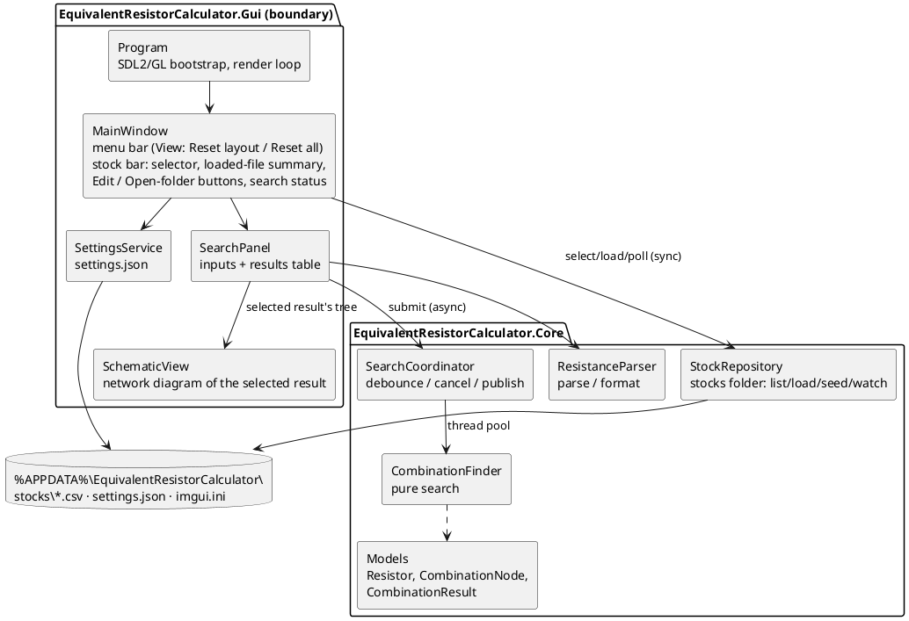
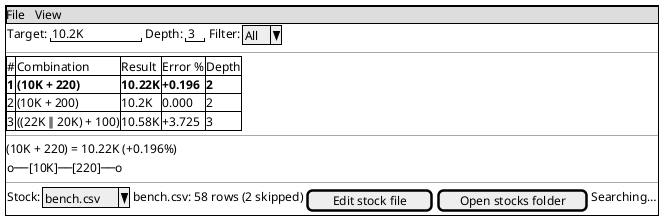
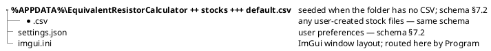
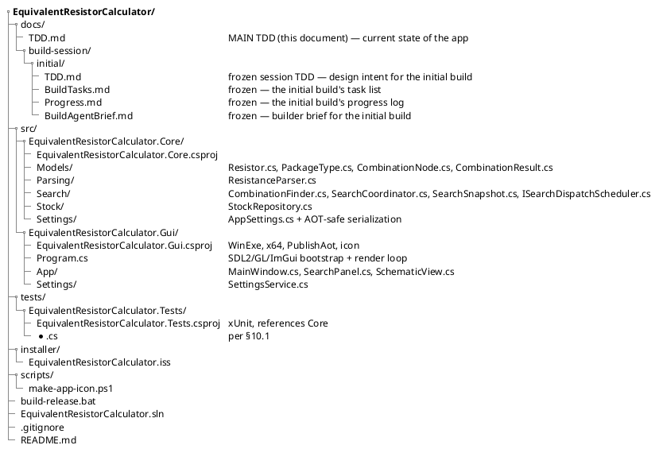

# Technical Design Document — Equivalent Resistor Calculator

**Owner:** Etienne Chenard
**Last updated:** 2026-07-12
**Status:** Shipped — describes the current state of the application after the initial build.

---

## 1. Requirements

**Problem this software solves.**
When building electronics, an exact resistance value is often unavailable in the parts bin. The existing console app at `C:\workplace\Code\ResistorCalculator` finds series/parallel combinations of on-hand resistors that approximate a target value, but its console menu UI is slow to operate. This project redoes that app as a full GUI desktop application; the console app is retired when this ships.

**Users and use cases.**
A single user (the owner) at a Windows desktop, using the tool at the electronics bench: type a target resistance, immediately see the best combinations buildable from the current stock; occasionally edit the stock to reflect the parts bin.

**Required capabilities (functional).**

- Find series/parallel resistor combinations approximating a target resistance, from a user-maintained stock (parity with the console app's algorithm — see §5.4 for the exact contract).
- Multiple stock files are supported: every `*.csv` in the per-user stocks folder is a selectable stock (owner decision 2026-07-11). Stock content is maintained by editing those CSVs externally — no in-app stock editor (owner decision 2026-07-11). The app supports this with: an in-app stock-file selector; the last-used stock file auto-loaded on startup; one-click "Edit stock file" (opens the selected CSV in the default editor) and "Open stocks folder" (opens Windows File Explorer at the folder) actions; automatic reload + re-search when the selected file changes on disk; and seeding of a `default.csv` whenever the folder contains no CSV (delete everything to reset to defaults).
- Filter the search by package type (ThroughHole / SMD / All).
- Configure maximum combination depth (1–20, default 3).
- GUI-natural upgrades over the console app: automatic re-search when any input or the stock file changes, sortable results table, copy-result-to-clipboard.
- A schematic view of the selected result: the top result is drawn automatically as a series/parallel resistor network diagram when results arrive, and clicking any results row redraws the diagram for that combination (owner request 2026-07-11 — see §5.8).
- A main menu bar with a View menu offering "Reset layout" (restore default window layout) and "Reset all" (restore layout AND all persisted settings to defaults), both confirmation-guarded, mirroring the Tek app (owner request 2026-07-11).

**Hard constraints (non-functional).**

- C# / .NET 8, Windows x64 only.
- GUI built with Dear ImGui via `Hexa.NET.ImGui` + SDL2 + OpenGL 3.3 backend, mirroring the bootstrap pattern of the private Tek reference implementation (`Program.cs`). ImPlot is NOT used (no plots in this app).
- Native AOT publish (`PublishAot=true`); all code must be AOT-safe (no unconstrained reflection; JSON via source-generated serializer context or manual read/write).
- Full Tek-style packaging: AOT-published exe, Inno Setup installer, `build-release.bat` release script, generated app icon.
- Stock data keeps the console app's CSV schema (`Value,Label,Package`); stock files live per-user in `%APPDATA%\EquivalentResistorCalculator\stocks\`. An existing `resistors.csv` is adopted by manually copying it into that folder (any filename) — no automatic migration.

**Existing systems and integrations.**
Replaces the console app at `C:\workplace\Code\ResistorCalculator` (kept on disk, untouched by this project). No other integrations; the app is fully offline and local.

## 2. Context

Standalone Windows desktop utility. Two sibling codebases inform it: the console `ResistorCalculator` supplies the domain behavior (search algorithm, parsing, CSV schema, default seed), and the private Tek reference implementation supplies the proven ImGui/SDL2/OpenGL application shell, settings conventions, and packaging pipeline. Code is written fresh in this repo; nothing is shared at the binary level with either sibling.

## 3. Goals

- **G-S1 — Search parity.** The combination search reproduces the console app's observable behavior exactly (same candidate generation, pruning, deduplication, ordering, top-20 truncation, description format) per §5.4.
- **G-S2 — Stock via CSV files.** Stock lives in per-user CSV files under a stocks folder: any number of stock files, selectable in-app, edited externally, auto-reloaded on change, openable in editor/Explorer from the app, filterable by package, with `default.csv` seeded when the folder is empty, per §5.5 and §7.
- **G-S3 — Responsive GUI shell.** A Dear ImGui desktop app (SDL2 + OpenGL 3.3, Tek-pattern bootstrap) whose UI never blocks: searches run off the UI thread and are cancellable per §5.3.
- **G-S4 — GUI-natural upgrades.** Automatic debounced re-search on any input change or stock-file change; sortable results table; per-row copy-to-clipboard; menu-bar Reset layout / Reset all commands per §5.6.
- **G-S5 — Persistence of preferences.** Max depth, package filter, and the last-used stock file survive restarts via a settings file; window layout survives via ImGui's ini per §7.
- **G-S6 — Packaging.** One command produces an AOT win-x64 build and an Inno Setup installer per §11 and the release-script contract in §5.7.
- **G-S7 — Tested core.** All decision logic lives in a host-free Core library covered by executable unit tests per §10.
- **G-S9 — Combination schematic view.** The selected results row is rendered as a series/parallel resistor network diagram, driven by a structured combination tree carried on every result, per §5.8 (owner request 2026-07-11).

(G-S8 Logging was removed by owner decision 2026-07-11 — see §9. The ID is retired, not reused.)

## 4. Non-goals

- No in-app stock editor (list/add/edit/remove/reset UI) — stock maintenance is external CSV editing (owner decision 2026-07-11).
- No in-app stock-file creation, renaming, or deletion — file management happens in Explorer/editor; the app only selects among existing files.
- No stock files outside the stocks folder (no arbitrary-path file dialog); all stock files live in `%APPDATA%\EquivalentResistorCalculator\stocks\`.
- No inventory quantity tracking (how many of each resistor is owned).
- No tolerance or power-rating modeling; resistors are ideal values.
- No network-solver mode (computing the equivalent of a user-described arbitrary network).
- No automatic migration/import of the old app's `resistors.csv`; adoption is a manual file copy.
- No logging of any kind (no file log, no in-app log viewer) — the only diagnostics are status-bar messages (§9).
- No localization, no theming beyond ImGui's dark style, no macOS/Linux support.

## 5. Architecture

The Gui project is a thin ImGui boundary: it renders state and forwards edits. Every computation, rule, and state transition lives in Core, which has no ImGui/SDL dependency and is exercised directly by the test project (G-S7).

### 5.1 Component responsibilities

**ResistanceParser** (Core) — parsing and formatting of resistance text (G-S1).
- Owns: parse of user text to ohms (suffixes `K`, `M`, `MEG`, `R`, case-insensitive, plain number = ohms; invariant culture); formatting of ohms to display text (`G4` precision with `K`/`M` suffix, matching the console app's `FormatResistance`).
- Does not own: input validation UX (the panel decides how to show a parse failure).

**Models** (Core) — `Resistor` (Value ohms, Label, Package), `PackageType` (ThroughHole, SMD), `CombinationNode` (expression tree for one combination: either a leaf resistor, or a series/parallel combination of a subtree and a leaf resistor; derives the §5.4 description string from its structure), `CombinationResult` (TotalResistance, ErrorPercent, Description, Tree — the root `CombinationNode` — ResistorsUsed, Depth). Plain data carriers, no behavior beyond display helpers (description derivation counts as one).

**CombinationFinder** (Core) — the pure search function (G-S1).
- Owns: the algorithm contract in §5.4, including cancellation via a `CancellationToken` checked at least once per depth level per outer candidate loop. Builds each candidate's `CombinationNode` tree as it combines; the description string is derived from the tree and is character-identical to the console app's format (parity is unchanged — dedupe still operates on the derived string).
- Does not own: threading, debouncing, or result publication (SearchCoordinator's job).

**StockRepository** (Core) — the stocks folder and the currently selected stock file, read-only except seeding (G-S2).
- Owns: enumeration of the folder's `*.csv` files (sorted case-insensitively by filename); seeding `default.csv` whenever the folder contains no CSV (first run or after the user deletes everything — that is the reset-to-defaults mechanism); selection of the current file with the fallback rules of §5.5; load of the selected file (skipping malformed rows and reporting a skipped-row count per load); package filtering; and on-disk change detection (selected file's last-write timestamp AND the folder's `*.csv` name-set, compared against the last load/enumeration; exposed as a cheap "has anything changed?" query).
- Does not own: the choice of the stocks folder (injected as a path so tests use a temp dir); persistence of the last-used selection (SettingsService's job); any mutation of stock files after seeding — the app never rewrites, renames, or deletes a stock CSV.

**SearchCoordinator** (Core) — async orchestration between UI and finder (G-S3, G-S4).
- Owns: accepting search requests (target ohms, depth, filtered stock snapshot); debouncing (a new request supersedes an undispatched one; dispatch fires 300 ms after the last request); cancelling the in-flight search when a newer request dispatches; running the finder on the thread pool; publishing a results snapshot (`SearchSnapshot`: results list + status `Idle` / `Searching` / `Done`, plus the empty/no-stock state) that the UI reads once per frame under a lock. Debounce dispatch is driven through an injectable scheduler (`ISearchDispatchScheduler`) so tests can advance it deterministically (§5.3).
- Does not own: parsing (receives ohms, not text) or rendering.

**Program** (Gui) — process entry; SDL2 + OpenGL 3.3 + ImGui bootstrap, render loop, shutdown. Mirrors the Tek app's `Program.cs` minus ImPlot and minus the offscreen-save context. Routes `imgui.ini` to the app data directory. **Owns the SDL window**; exposes a small window-geometry-reset hook (a callback injected into MainWindow at construction) that restores the native window to the default startup size (1280×800) and re-centers it on the current display — invoked by MainWindow's Reset layout / Reset all handlers (§5.6). The raw SDL window pointer stays inside Program: MainWindow calls the injected hook and does not manage the SDL window directly. Owns nothing domain-level.

**MainWindow** (Gui) — top-level layout: a full-viewport window hosting the SearchPanel and a stock/status bar containing: the stock-file selector combo (always displaying the loaded file's name — the loaded stock must be unmistakable in the UI, owner requirement 2026-07-11); the loaded-stock summary (filename-prefixed row count matching the filter, plus a skipped-malformed-rows warning when nonzero — §9); the "Edit stock file" button (opens the selected CSV in the OS default editor via shell-execute); the "Open stocks folder" button (opens Windows File Explorer at the stocks folder); and the search status. The stock summary is recomputed whenever the loaded stock changes **and** whenever the package filter changes (SearchPanel notifies MainWindow on a filter change via a refresh callback), so the filename-prefixed row count always matches the current filter without a disk reload. Also owns the main menu bar (Tek pattern): a View menu with "Reset layout" and "Reset all", each opening a small confirmation modal before acting per §5.6. Polls StockRepository's change query at most once per second; on change, reloads/refreshes and resubmits the current search. Persists the selected file to settings on change. Wires panels to Core services; owns app-quit intent.

**SearchPanel** (Gui) — renders target-resistance text input, depth control (integer input clamped 1–20), package filter combo (All / ThroughHole / SMD), and the results table (§5.6) with single-row selection (the top row is auto-selected whenever a new snapshot arrives). Hosts the SchematicView below the table and feeds it the selected result. Forwards every input change to SearchCoordinator; renders parse errors inline. When the target text is empty/cleared or fails to parse, it submits a **no-target/clear request** to SearchCoordinator (in addition to showing any inline parse error) so the coordinator publishes an empty snapshot and the table + schematic revert to the empty state together — the panel never leaves a stale non-empty snapshot on screen after the target is cleared (§5.8).

**SchematicView** (Gui) — renders the selected result's `CombinationNode` tree as a 2-D resistor network diagram via the ImGui draw list (§5.8, G-S9).
- Owns: recursive layout (series chains horizontal, parallel branches vertically stacked between junction dots), labeled resistor glyphs, wires and terminals, fit-to-region scaling.
- Does not own: selection state (SearchPanel's job) or any computation — it reads the tree as-is.

**SettingsService** (Gui) — thin wrapper that picks the settings file path and calls through to Core's AppSettings model, which owns the AOT-safe serialization and the defaults-on-missing/corrupt rules (§7.2) so they are unit-testable. Loads at startup, saves on change. Same role as the Tek app's SettingsService, much smaller.

### 5.2 Data flow (happy path)

1. User types into the target field (e.g., `10.2K`).
2. SearchPanel parses via ResistanceParser; on success it submits (ohms, depth, package filter) to SearchCoordinator; on failure it shows the error inline and submits a no-target/clear request (§5.8).
3. SearchCoordinator debounces 300 ms, cancels any in-flight search, and runs CombinationFinder on the thread pool against the stock snapshot carried by the request (the panel obtains the filtered snapshot from StockRepository when it submits; the coordinator never touches the repository).
4. Finder returns top combinations; SearchCoordinator swaps them into its published snapshot with status Done.
5. Next frame, SearchPanel reads the snapshot and renders the results table; the top row is auto-selected and the SchematicView draws its network diagram.
6. User clicks a different row to inspect it — the schematic redraws for that combination — or clicks a column header to re-sort, or right-clicks a row and copies it to the clipboard.
7. To change stock content, the user clicks "Edit stock file" (or "Open stocks folder" and picks a file), edits the CSV, and saves; within a second MainWindow's change poll notices, reloads the stock, updates the stock bar, and resubmits the current search so results reflect the new stock.
8. To switch stocks, the user picks another file in the selector combo; the app loads it, re-searches, and persists the choice to settings so the same file auto-loads on next startup. New files dropped into the stocks folder appear in the combo within a second.

### 5.3 Threading / concurrency model

- **UI thread:** the SDL/ImGui render loop. All Gui code and all StockRepository calls run here (stock CSVs are tiny; synchronous IO is acceptable), including the once-per-second change poll — a timestamp compare plus a folder listing of a small directory, cheap enough for the render loop. No Core state is mutated from the UI thread except through SearchCoordinator's request API and StockRepository's select/load/reload API.
- **Search execution:** SearchCoordinator runs at most one CombinationFinder call at a time on the thread pool. Each request carries its own cancellation token; dispatching a newer request cancels the older token. A cancelled search's results are discarded, never published.
- **Handover:** the published snapshot (results + status) is guarded by a lock; the UI reads it once per frame; the worker replaces it wholesale. No other shared mutable state crosses the thread boundary.
- **Debounce timing:** owned by SearchCoordinator through an injectable dispatch scheduler (`ISearchDispatchScheduler`), so tests advance dispatch deterministically without real-time sleeps and the §10.1 debounce/cancellation scenarios are satisfiable.
- **Shutdown:** app exit cancels **every** outstanding dispatch and joins/awaits **all** of them before disposing services. "Every outstanding dispatch" explicitly includes a *superseded* search that a newer `Submit` cancelled but that is still winding down (between the cancel request and the point where its worker observes cancellation and releases `_searchGate`) — not merely the latest tracked request. Concretely: `SearchCoordinator` retains a handle to each in-flight dispatch task (not just a single `_activeSchedule` overwritten on the next `Submit`), and `Dispose` cancels all active tokens, awaits all outstanding dispatch tasks to completion (swallowing `OperationCanceledException`), and only then disposes `_searchGate`. Disposing the gate while any dispatch can still reach its `_searchGate.Release()` is a defect: `Release()` on a disposed `SemaphoreSlim` throws `ObjectDisposedException` on an unawaited background task, so the superseded search is never truly joined. No dispatch may touch `_searchGate` after it is disposed.

### 5.4 Search algorithm contract (G-S1 — parity with the console app)

Reference implementation: `C:\workplace\Code\ResistorCalculator\ResistorCalculator\Services\ResistorCombinationFinder.cs`. The new finder reproduces its observable behavior exactly:

- **Error metric:** `errorPercent = (actual − target) / target × 100`; if target is 0, error is 0 when actual is 0, otherwise effectively infinite (excluded by pruning).
- **Level 1:** every stock resistor individually. Level-1 candidates are added to the overall result pool **unconditionally** (no prune) — the nearest single resistors always appear even when far from the target.
- **Levels 2..maxDepth:** each surviving candidate from the previous level is combined with every stock resistor, in series (`prev + r`) and in parallel (`prev·r / (prev + r)`). A combination enters the pool and the next level only if `|errorPercent| < 500`.
- **Description format:** level 1 is the resistor's label; series is `(<prev> + <label>)`; parallel is `(<prev> || <label>)`. Deduplication is by exact description string across the whole search.
- **Beam limit:** after each level, only the 500 candidates with smallest `|errorPercent|` seed the next level.
- **Result:** the pool ordered by `|errorPercent|` ascending, truncated to 20.
- **Additions over the console app (behavior-preserving):** cancellation support — the finder observes its `CancellationToken` and aborts by throwing `OperationCanceledException` (the standard .NET contract); SearchCoordinator catches this and discards the attempt; a `Depth` value on each result row (already computed by the old code; now displayed); and a `CombinationNode` expression tree on each result (§5.8) from which the description string is derived — the derived string is character-identical to the console app's format, and dedupe operates on it exactly as before.
- Depth is clamped to 1–20 (default 3). MaxResults stays fixed at 20 in v1.

### 5.5 Stock behavior contract (G-S2)

- **Stocks folder:** `%APPDATA%\EquivalentResistorCalculator\stocks\`, created on first run. Every `*.csv` in it (non-recursive) is a stock file; the selector lists them by filename, sorted case-insensitively. No files outside this folder are ever loaded (§4).
- **Default seed:** whenever a load, reload, or enumeration finds the folder contains no `*.csv`, the app seeds `stocks\default.csv` with exactly the console app's list — the 30 values from 10 Ω to 10 MΩ in `DatabaseManager.SeedDefaultStock`, each in both ThroughHole and SMD (60 rows). Deleting every stock file is therefore the reset-to-defaults mechanism. Seeding is the only write the app ever performs in the stocks folder. **The seed guard binds every folder-touching entry point of `StockRepository`, including `Load(fileName)`, which is self-contained and must never throw on a missing file or empty folder:** `Load` reseeds `default.csv` when the folder is empty, and when the requested `fileName` does not exist (the selected file vanished at runtime, §5.5 fallback) it loads the first file alphabetically instead and reports that filename as the loaded file. A reload triggered after the selected file — or the whole folder — was deleted therefore reseeds and returns the fallback stock, never a `FileNotFoundException`. (Callers such as MainWindow's poll may still re-`Select` first; `Load`'s self-guarding is defense-in-depth that keeps the repository robust regardless of call order.)
- **Selection and startup:** the selected file's name is persisted in settings (§7.2). On startup the app selects the persisted file if it still exists; otherwise (missing, null, or first run) the first file alphabetically — after seeding if the folder was empty. The same fallback applies at runtime if the selected file disappears; the switch is reflected in the stock bar.
- **Visibility (owner requirement 2026-07-11):** the loaded stock file must be unmistakable in the UI at all times — the selector combo displays its name and the stock summary is prefixed with it (§9).
- **External editing is the only content-mutation path:** "Edit stock file" opens the selected CSV in the OS default editor; "Open stocks folder" opens Windows File Explorer at the folder for file management (create/rename/delete/copy). There is no in-app add/edit/remove/reset UI (§4).
- **Change detection:** StockRepository tracks the selected file's last-write timestamp and the folder's `*.csv` name-set as of the last load/enumeration. MainWindow polls at most once per second; on a file-content change it reloads and resubmits the current search; on a listing change it refreshes the selector (applying the fallback rule if the selected file vanished).
- **Malformed rows** (wrong column count, unparseable value or package) are skipped on load; the per-load skipped count is surfaced in the stock bar (§9). Stock files are never rewritten, so the user's original content — including malformed lines they may want to fix — is preserved.
- **Labels:** the CSV's `Label` column is the display text. An empty label falls back to the canonical formatted value (e.g., `10.2K`). A label containing a comma produces an extra column and is treated as a malformed row.

### 5.6 Results-table and upgrade behaviors (G-S4)

- **Auto re-search:** any change to target text, depth, package filter, the selected stock file's content, or the selection itself (§5.5) triggers a debounced re-search. While a search runs, the stock bar shows "Searching…"; previous results stay visible until replaced.
- **Results table columns:** `#` (rank), `Combination` (description), `Result` (formatted resistance), `Error %` (signed, 3 decimals, matching the console app's `+0.000;-0.000;0.000` format), `Depth`. Sortable by clicking Result, Error % (absolute value), or Depth headers; default sort is |Error %| ascending (rank order). Rows are single-selectable to drive the schematic view (§5.8).
- **Copy to clipboard:** per-row action (context menu or button) copying `"<description> = <formatted result> (<signed error>%)"` via ImGui's clipboard API.
- **No-stock case:** when the filtered stock is empty, the results area shows "No resistors in stock matching the current filter" instead of a table.
- **Reset layout** (View menu, confirmation modal): discards the current window layout and restores the default layout, which means **both** (a) the ImGui-internal layout state — the Tek app's `LoadIniSettingsFromMemory("")` approach; `imgui.ini` overwritten with the defaults on exit — **and** (b) the **native OS window geometry**: the SDL window is restored to its default startup size (1280×800) and re-centered on the current display. Because this is a single full-viewport app with no floating ImGui windows, resetting the ImGui ini alone produced no visible change and left the user-resized native window untouched, so the native-geometry restore is required for Reset to be observable (owner decision 2026-07-12). Search inputs and settings values are untouched.
- **Reset all** (View menu, confirmation modal): performs Reset layout (including the native window-geometry restore above) AND restores every settings.json value to its default (MaxDepth 3, PackageFilter null, StockFile null — which re-applies the §5.5 selection fallback), then re-searches. The target text is transient (never persisted) and stays as typed. Stock CSV files are user data and are NOT touched (§7.3).

### 5.7 Packaging contract (G-S6)

- `build-release.bat` at the repo root: runs `dotnet publish` (Release, win-x64, AOT) and then Inno Setup's `ISCC.exe` against `installer/EquivalentResistorCalculator.iss`, producing a zip of the publish folder and an installer exe under `publish/`. Mirrors the Tek reference implementation's `build-release.bat`.
- `scripts/make-app-icon.ps1`: generates `EquivalentResistorCalculator.ico` (simple programmatic resistor-glyph icon; visual quality is not a goal) consumed by the Gui csproj's `ApplicationIcon`.
- Version metadata (Product, Version 1.0.0, Authors) embedded in the csproj like the Tek Gui csproj.

### 5.8 Combination schematic view (G-S9)

- **Selection:** the results table supports single-row selection. When a new results snapshot is published, the top row (rank 1) is auto-selected; clicking any row selects it. Selection is transient — never persisted; Reset all's re-search republishes results and re-auto-selects the top row.
- **Rendering:** SchematicView draws the selected result's `CombinationNode` tree in a dedicated region below the results table using the ImGui draw list. Layout rules: two terminals (left and right); a series combination draws its operands left-to-right as a horizontal chain; a parallel combination draws its operands as vertically stacked branches between two shared junction dots; each leaf resistor is a labeled rectangle glyph (label drawn with the box). Nesting recurses — a parallel branch may contain a series chain and vice versa, mirroring the tree exactly.
- **Endpoint dots (one dot per point):** each of the two network terminals renders **exactly one** connection dot. When the outermost node at a terminal is a parallel combination, its shared junction dot at that boundary **is** the terminal dot — do not draw a second terminal dot or a terminal stub leading to it there (owner decision 2026-07-12, fixing the double-dot render seen on `(10K || 4.7M) + 220`). More generally, never draw two coincident or near-coincident dots at the same network point: a junction dot that lands at a terminal serves as that terminal. The rule is symmetric for the left and right terminals and applies at whatever boundary the coincidence occurs.
- **Header:** the region is titled with the selected result's summary, the same string the clipboard copy produces: `<description> = <formatted result> (<signed error>%)`.
- **Scaling:** the drawing is scaled and centered to fit the available region with a sensible minimum glyph size; when it cannot fit (deep combinations), the region scrolls horizontally. Polish is personal-tool level — clarity over beauty.
- **Empty state:** no results (target text empty or cleared, parse error, empty stock, nothing searched yet) ⇒ the region shows a muted placeholder ("no combination selected") instead of a drawing. The empty state is **driven by the published snapshot, not by the view hiding stale data**: when the current target is not a valid search (empty/cleared input or a parse failure), SearchPanel submits a no-target/clear request so SearchCoordinator publishes an empty snapshot, and the results table and schematic revert to the empty state **together**. The view never keeps rendering a previous non-empty snapshot after the target is cleared (owner report 2026-07-12: clearing the target left the old table + drawing on screen).

### 5.9 UI mockup

PlantUML Salt mockup of the main window (informative — spacing and exact widget order are implementation detail within §5.1's ownership rules):

Row 1 is the menu bar (View → Reset layout / Reset all). Row 2 is the SearchPanel input strip. The table is the §5.6 results table with the selected row bold — `∥` in the sample rows stands for the real `||` description operator (a literal `|` is a cell separator in Salt tables). Below it, the SchematicView region with its header line and the network drawing (the `o──[..]──o` line stands in for the draw-list rendering — parallel branches stack vertically between junction dots). The bottom strip is MainWindow's stock/status bar (§5.1).

## 6. Wire contract

Not applicable — the app exposes no API to external callers. (Section retained to keep template numbering stable.)

## 7. Persistence

All per-user state lives in `%APPDATA%\EquivalentResistorCalculator\`, created on first run.

### 7.1 On-disk layout

Stock files are never rewritten, renamed, or deleted by the app; `default.csv` seeding is its only write in `stocks\`.

### 7.2 Schema

**Stock CSV (`stocks\*.csv`)** — identical to the console app's format. Header line `Value,Label,Package`; one row per resistor: `Value` (double, invariant culture), `Label` (display text; empty ⇒ formatted-value fallback; a comma makes the row malformed per §5.5), `Package` (enum name `ThroughHole` or `SMD`).

**settings.json** — `{ "MaxDepth": <int 1-20>, "PackageFilter": "ThroughHole" | "SMD" | null, "StockFile": "<filename>.csv" | null }`. `StockFile` is a bare filename within the stocks folder (never a path); null, missing, or naming a nonexistent file ⇒ the §5.5 selection fallback. Missing file or unreadable content ⇒ all defaults (3, null, null) and the file is rewritten. Serialized AOT-safely (source-generated context or manual).

### 7.3 Retention and deletion

- Stock files are never deleted or rewritten by the app; the user manages them in Explorer. Emptying the folder triggers a `default.csv` reseed (§5.5). This holds even for the menu resets (§5.6): Reset layout rewrites only `imgui.ini`; Reset all rewrites `imgui.ini` and `settings.json` (back to defaults) but never touches `stocks\`.
- The uninstaller does not delete `%APPDATA%\EquivalentResistorCalculator\` (user data survives reinstall).

## 8. Security

Local, offline, single-user tool. No authentication, no network, no secrets. File access is limited to the app's own `%APPDATA%` folder.

## 9. Logging and observability

None (owner decision 2026-07-11 — G-S8 retired). The app writes no log files and takes no logging dependencies. The single diagnostic that matters — malformed CSV rows skipped at load — is surfaced directly in the stock bar as a warning count within the filename-prefixed stock summary (e.g., "bench.csv: 58 rows (2 skipped)"), sourced from StockRepository's per-load summary (§5.5). Fatal bootstrap failures (SDL/GL init) surface via a message box / stderr and a nonzero exit code.

## 10. Testing strategy

Test project: `tests/EquivalentResistorCalculator.Tests` (xUnit), referencing Core only. The Gui boundary stays thin enough that it contains nothing worth unit-testing (G-S7); anything with a branch belongs in Core.

### 10.1 What is tested

| Behavior / area | Test artifact | Verification command |
|---|---|---|
| ResistanceParser — suffix parsing (`K`/`M`/`MEG`/`R`, case-insensitive, plain ohms), invalid inputs rejected (G-S1) | `tests/.../ResistanceParserTests.cs` | `dotnet test` |
| ResistanceParser — formatting matches console app's `FormatResistance` (`G4`, `K`/`M` thresholds) (G-S1) | `tests/.../ResistanceParserTests.cs` | `dotnet test` |
| CombinationNode — description derivation matches §5.4 exactly (leaf label, nested series `( + )`, parallel `( \|\| )`, empty-label fallback); finder-built trees reproduce the legacy description strings (G-S1, G-S9) | `tests/.../CombinationNodeTests.cs` | `dotnet test` |
| CombinationFinder — series/parallel math, description format, dedupe by description, order by \|error\|, top-20 truncation (G-S1) | `tests/.../CombinationFinderTests.cs` | `dotnet test` |
| CombinationFinder — level-1 results bypass the 500 % prune; deeper levels don't; beam limit of 500 applied per level (G-S1) | `tests/.../CombinationFinderTests.cs` | `dotnet test` |
| CombinationFinder — cancellation aborts promptly by throwing `OperationCanceledException`, per §5.4 (G-S3) | `tests/.../CombinationFinderTests.cs` | `dotnet test` |
| StockRepository — seeds the exact 60-row default when file absent (first load AND reload-after-delete); no reseed when present (G-S2) | `tests/.../StockRepositoryTests.cs` | `dotnet test` |
| StockRepository — load parses valid rows; malformed rows skipped and counted in the load summary; package filter; empty-label formatted-value fallback (G-S2) | `tests/.../StockRepositoryTests.cs` | `dotnet test` |
| StockRepository — change detection: query is false after load, true after the file's timestamp changes, false again after reload (G-S2, G-S4) | `tests/.../StockRepositoryTests.cs` | `dotnet test` |
| SearchCoordinator — debounce coalesces rapid requests into one dispatch (deterministic scheduler, no real sleeps) (G-S4) | `tests/.../SearchCoordinatorTests.cs` | `dotnet test` |
| SearchCoordinator — newer request cancels in-flight older search; cancelled results never published; latest request wins (G-S3) | `tests/.../SearchCoordinatorTests.cs` | `dotnet test` |
| SearchCoordinator — status transitions Idle → Searching → Done; empty-stock message state (G-S3, G-S4) | `tests/.../SearchCoordinatorTests.cs` | `dotnet test` |
| Settings round-trip — defaults on missing/corrupt file (also the canonical defaults Reset-all applies), persisted values incl. StockFile reload (G-S5) | `tests/.../SettingsTests.cs` (settings model lives in Core so it is host-free testable) | `dotnet test` |

No security- or money-path behaviors exist in this app (§8).

### 10.2 What is NOT tested (and why)

- ImGui panel rendering, layout, and input wiring — thin boundary over Core state; exercising it requires a GL/SDL host; all decision logic is already covered in Core.
- SchematicView draw-list geometry (glyph positions, wire routing, scaling) — verified visually at the build's manual gate; the tree structure and description derivation it renders are Core-tested (`CombinationNodeTests`).
- SDL/OpenGL bootstrap (`Program`) — verified by launching the app (manual gate during build), not by unit test.
- Installer/release script — verified once manually at the packaging task.

### 10.3 Test execution

Verification command: `dotnet test` from the repo root (plus `dotnet build` for Gui-only changes). Any change implementing a §10.1 behavior runs that behavior's tests. Local-only; no CI pipeline. No coverage target.

## 11. Directory layout

Assembly/exe name: `EquivalentResistorCalculator`; window title: `Equivalent Resistor Calculator`.

The initial build session's design intent, task list, progress log, and builder brief are frozen in git under `docs/build-session/initial/` as the historical record; this document (the main TDD) is the current-state description and the starting point for any future session.

## 12. Sub-TDDs

None — the design fits in this single document. The GUI bootstrap deep-dive is delegated to the Tek reference implementation cited in §1 hard constraints.
